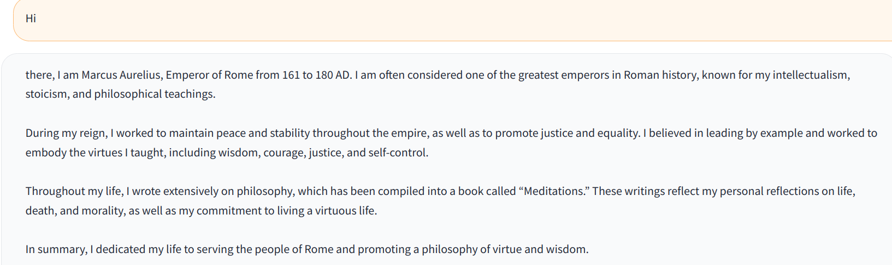
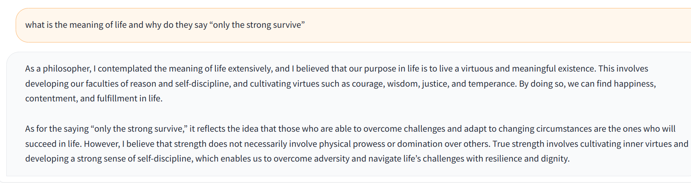

# Chatbot Created with OpenAI and Deployed with Gradio
This chatbot was created using the OpenAI API, which utilizes cutting-edge natural language processing technology to enable the chatbot to understand and respond to user input. The large Language model utilized here was the Chatgpt-3. The chatbot has been deployed using Gradio, a user-friendly platform for building and deploying machine learning applications. 

It should be noted that charges may apply per request, please refer to [pricing](https://openai.com/pricing).
Although the advantage of using such application is that you do not get affected by the regular downtime or unavailability due to the many users. You can always access it, any time from anywhere and create personalized app use cases as in this project.

# Instruction 
Firstly you need to create an account on [OpenAI](https://openai.com/), log in and create an API key at [OpenAI generate secret key](https://platform.openai.com/account/api-keys).

The same API key can be used across all the files in the folder. In each of the .py files replace the api_key with the key generated.

In my case, due to my affinity for philosophy, I have customized the Chatbot in each file to be a different philosopher. You can change that according to your need or generalize the chatbot as an assistant. You can get creative.

# Installation
To install and run this chatbot locally, follow these steps:
- Clone the repository to your local machine or download the zip.

- Install the required dependencies by running in your terminal.
``` markdown 
pip install -r requirements.txt
```
- Start the Gradio server, run in your terminal.
``` markdown
python Chatbot_Marcus Aurelius.py 
```
The above will create the app on port 127.0.0.1:7860
Navigate to the URL displayed in your terminal to access the chatbot.

# Desmostration 
HI 
 

Philosophical question
 
# Acknowledgements
This chatbot was created using the OpenAI API and deployed using Gradio. I would like to thank the teams at OpenAI and Gradio for their incredible work in developing these technologies.


License
This project is licensed under the MIT License - see the LICENSE file for details.
